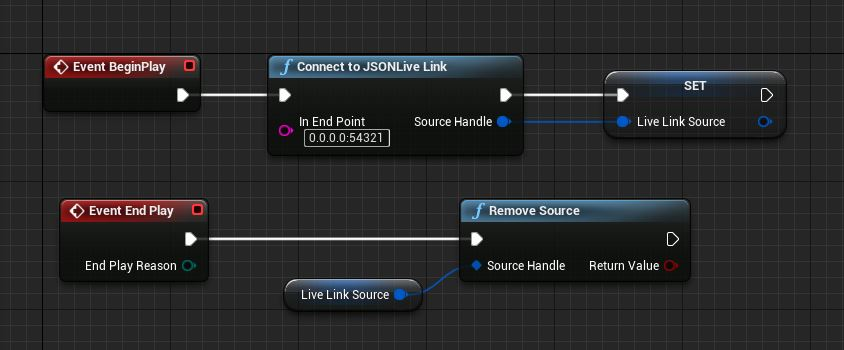

# JSONLiveLink

LiveLink Source for receiving JSON over sockets.

This is an example of how a LiveLink plugin can be implemented inside UE4. The plugin is not intended to be used in production.

See https://docs.unrealengine.com/en-US/Engine/Animation/LiveLinkPlugin/index.html for more information about UE4 LiveLink.

## Blueprint

This fork of the plugin includes the code to allow blueprints to instantiate the JSON Live Link Source connection.   This allows the connection to be created from level blueprint at run time rather than just by the user in the editor.

Note: To use this in a packaged build would require it is a development build and the build must be started passing in the command line argument "-messaging".   

